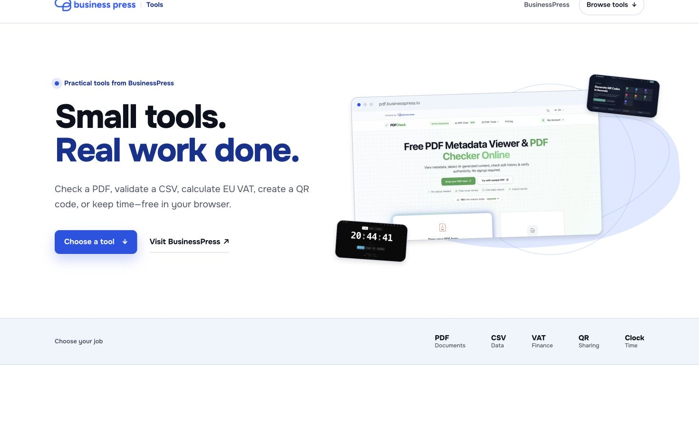

# BusinessPress Tools

The public directory for BusinessPress utilities at `tools.businesspress.io`.



## Local development

```bash
python3 -m http.server 4173 --directory public
```

Then open `http://127.0.0.1:4173/`.

## Tests

```bash
node --test tests/site.test.mjs
```

## Brand asset

The official BusinessPress logo is stored locally at `public/assets/brand/businesspress-logo.png`. It was downloaded from the asset referenced by [businesspress.io](https://businesspress.io/): `https://pdf.businesspress.io/build/images/bp-logo.png`.

## Analytics and attribution

Pageviews are recorded through `https://stats.businesspress.io/js/script.js` for the `tools.businesspress.io` domain. External links open in a new tab and use the shared campaign parameters `utm_source=tools.businesspress.io`, `utm_medium=referral`, and `utm_campaign=businesspress_tools_hub`.

## Deployment

The repository is a static site. Point the web server root to `/public`; no build command or runtime process is required.
